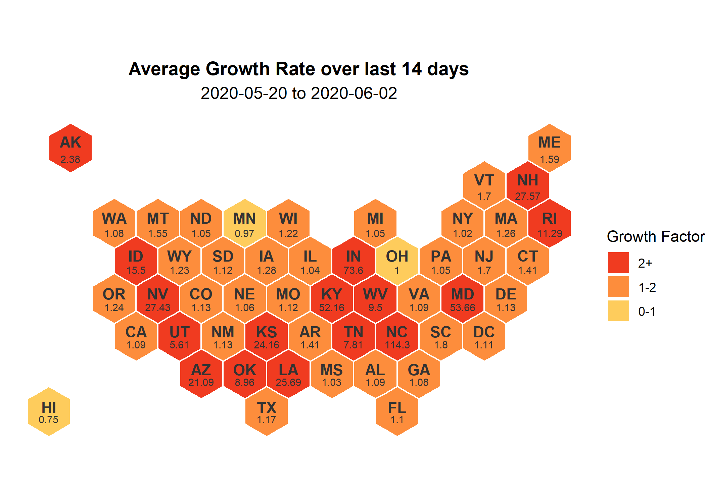

```{r hex-map, message = FALSE, results = "hide", warning = FALSE}
source("script/plot/hex-map.R") #creates hex map of state avg gf for past n days
```

This plot is a quick overview of the last two weeks for each state.  Which states have seen an average decrease in daily cases for 14 days and may be ready to start the re-opening process?  Which states are not ready to reopen and finally which states may need additional social-distancing and lock-down measures?  

As mentioned in the Growth Factor tab, some states will have very large growth rates.  This is mostly due to having 0 cases on one day and then a large amount the next day - likely caused by test availability or reporting.  

```{r hex-map-img, out.width = "100%", fig.align = 'center'}

```