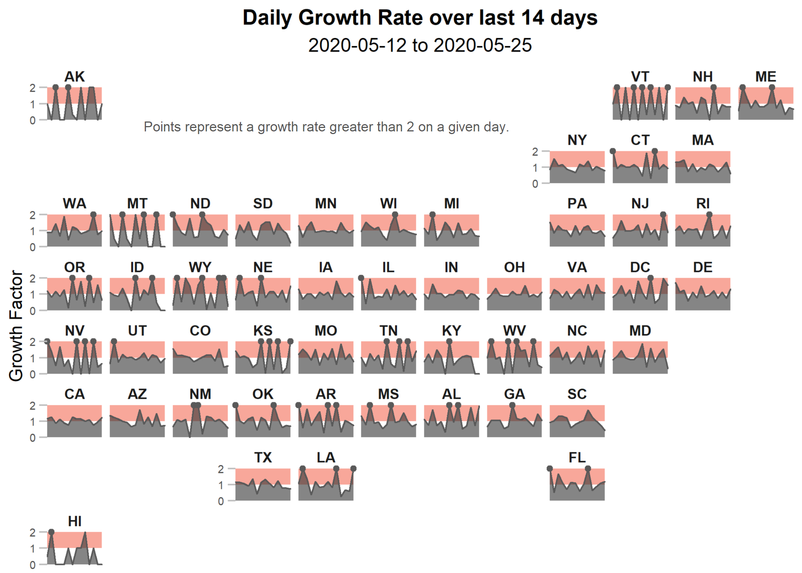

```{r packages-global-options, results="hide", warning=FALSE, message=FALSE, include = FALSE, eval = TRUE }
#not needed for knitting with other rmd 
library(tidyverse)
library(gridExtra)
library(grid)
library(knitr)
library(lubridate)
library(scales)
library(ggrepel)
library(kableExtra)
library(latex2exp)
library(cowplot)
knitr::opts_chunk$set(fig.width=8, fig.height = 4, dpi=300, echo=FALSE)
source("script/dataframe/covid19_US.R") #run script for covid19 df 
source("script/variable/colors.R") #colors 
source("script/variable/parameters.R") #global parameters; also imports data 
```


I am restricted the charts to show values on March 15, 2020 and after.  This is when cases numbers started to rise and preventative measures started to increase dramatically.  


### Is the pandemic slowing? 

One important calculation is the growth factor, as outlined in <a href = "https://www.youtube.com/watch?v=Kas0tIxDvrg" target = "_blank"> 3Blue1Brown's youtube video on exponential growth </a>.  The growth rate is calculated as follows: 

$$
\text{Growth Factor} = \frac{ \text{New-Cases}_N}{\text{New-Cases}_{N-1}}
$$
where $N$ is a given day.  Essentialy this is taking the amount new cases today and dividing them by the amount of new cases yesterday.  

The growth factor can be very helpful in determining if the pandemic is slowing.  If the growth factor is less than 1, this means that the amount of new cases today is less than yesterday.  Once there are multiple days with a growth factor less than 1 - this is a strong sign that the pandemic is slowing down.  

**Adjustment to Growth Factor**  
What if there were 0 cases yesterday?  This would make the growth factor undefined (or $\infty$ according to R).  This makes it difficult to look at trends.  I have adjusted the growth factor so that if the pervious day had 0 cases; the current day's growth factor is equal to the number of new cases: 

$$
\text{Growth Factor} = \begin{cases}
\frac{ \text{New-Cases}_N}{\text{New-Cases}_{N-1}} & \text{if } \text{New-Cases}_{N-1} \neq 0 
\\[1ex]
\text{New-Cases}_N & \text{if } \text{New-Cases}_{N-1} = 0 
\end{cases}
$$
When I made this adjustment I was thinking about the early stages of the pandemic when the number of cases per day are 0, 1, or 2.  However, given the test scarcity and reporting times there are situations in counties or states where there were 0 cases one day and then hundred or thousands the next day.  This is why some of growth factors are much larger.  


```{r gf-plot-setup, fig.width=4, fig.height=4}
#captions 
gf_max <- max(covid19_US_adj$growth_factor)


cap_gf <- paste(
  strwrap("A growth factor below 1 means new cases are decreasing,\ni.e. the pandemic is slowing"
          , 30)
  , collapse = "\n"
)

#plot set up 
plot_gf  <- ggplot(covid19_US_adj, aes(x=date, y=growth_factor))+
  annotate("rect", xmin = x_min, xmax = x_max, ymin = 1, ymax =  Inf, fill = gf2plus, alpha = 0.2) +
#  geom_line(alpha=0.6) +
  geom_area(alpha = 0.3) +
  annotate("text", x = x_min + 1, y = 0, label = cap_gf, vjust=-0.3, hjust= -0.1, size = 3, color = "grey15") +
  date_scaling +
  scale_y_continuous(limit = c(0, 2), expand = c(0, 0)) +
  theme_minimal()+
  theme(
      plot.title = element_text(hjust = 0.5, size = subtitle_size)
    , axis.title.x=element_blank()
    , axis.title.y=element_blank()
    , plot.margin  = margin(t=0, r=15, b=0, l=0)
    , axis.ticks.length = unit(5, "pt")
  ) 
```


Similar to the new cases per day; there can be a lot of variability in growth rates.  In order to get a better sense of the trend I am showing a 14-day moving average of the growth factor.  

The growth rate shows a different trend than new cases.  Here, the growth rate has stayed around 1 since mid-April.  Compare that to the new cases plot on the Overview tab, which shows a downward trends.  The the growth factor remaining around 1 due may be due to the cyclical nature of new cases reporting (high during the week, low during the weekends) - but it could also be showing that although the decrease in new cases is positive we are not out of the woods yet.  

```{r}
labels_gf <- covid19_US %>% filter(date == as.Date("2020-05-02"))


plot_gf_ma  <- plot_gf + 
  geom_line(
      aes(y = MA_growth_factor)
    , size = 1.25
    , color = blue_comp
    , alpha = 0.6
  ) + 
  geom_text_repel(
      seed = 100
    , data = labels_gf
    , aes(y = MA_growth_factor, label = "14-Day\nMoving Average")
    , color = blue_comp
    , nudge_y = 0.5
    , nudge_x = 3
  ) +
  ggtitle("Growth Factor per Day")


plot_gf_ma
```


<br>  
  
### Recent Values by Day for US

```{r values-table-gf}
#transpose table; easier to read
covid19_US_adj %>%
  arrange(desc(date)) %>%
  top_n(14, wt=date) %>%
  #format data for output tabe
  mutate(
      Date = format(date, '%a, %b %d, %Y')
    , `Total Cases` = formatC(total_cases, big.mark=",", format="d")
    , `New Cases`  = formatC(new_cases, big.mark=",", format="d")
    , `Growth Factor` = round(growth_factor, 2)
    , `Growth Factor 14-day MA` = round(MA_growth_factor, 2)
    , `New Cases 14-Day MA` = formatC(MA_new_cases, big.mark=",", format="d")
  ) %>%
  #color Growth Factor based on value 
  mutate(
    `Growth Factor` = cell_spec(
      `Growth Factor`, color = 
          ifelse( growth_factor > 1, gf2plus,
                  ifelse(growth_factor > 0, colorspace::lighten(gf2plus, 0.4), "grey35"))
      , bold = T
      ), 
    `Growth Factor 14-day MA` = cell_spec(
      `Growth Factor 14-day MA`, color = 
          ifelse( MA_growth_factor > 1, gf2plus,
                  ifelse(growth_factor > 0, colorspace::lighten(gf2plus, 0.4), "grey35"))
      , bold = T
      )
  ) %>%
  #re-order to group cases and death information together 
  select(
      Date
    , `Total Cases`
    , `New Cases`
    , `New Cases 14-Day MA`
    , `Growth Factor`
    , `Growth Factor 14-day MA`
    ) %>%
  kable(
    align=c('l', rep('r', 6))
    , escape = F
  ) %>%
  kable_styling(
    bootstrap_options = c(
      #adds stiped color to rows
        "striped"
      #highlight row when hover over it 
      , "hover"
      #table doesn't have to be full width 
      , full_width = FALSE
      #make it horizontally scrollable
      , "responsive"
      )
    )  %>%
  row_spec(1, bold=T, background = "rgba(0, 0, 0, .05)")
```

<br>  

### Recent Growth Factor for each state 

Since most of the COVID-19 measures are enacted by the state; it may be more helpful for the individual to see the growth factor for the last 14 days in a specific state.  

```{r geofacet, message = FALSE, results = "hide", warning = FALSE}
source("script/plot/geofacet.R") #creates facet_map of states' raw gf for past 14 days 
```


```{r, out.width = "100%", fig.align = 'center'}

```
<br>

### Still want to look at more plots? 

Build your own growth factor plot for a given state and time period by using a shiny app.  The app can be access through this  link, <a href="https://mareichler.shinyapps.io/diy-covid19-plots/" target = "_blank">mareichler.shinyapps.io/diy-covid19-plots/</a>, and is also embedded below:  

```{r, out.width = "100%"}
knitr::include_app("https://mareichler.shinyapps.io/diy-covid19-plots/", height = "500px")
```

<br> 

### Growth Rate 14-day moving average or growth rate on 14-day moving average of new cases? 

What if instead of looking at the growth rate and average of the growth rate - we calculated the growth rate on the average of new cases?  I'm going to call this $\text{GF}_{14}$ to represent that it's the growth rate based on the 14-day moving average of new cases.  

Looking at the new cases 14-day moving average, it is clearly smoother than the raw new cases.  

```{r, fig.height = 2.5}
plot_ma_nc <- ggplot(covid19_US_adj, aes(x=date, y=MA_new_cases))+
  geom_line(alpha=0.6, color = blue_comp) +
  geom_area(alpha = 0.3, fill = blue_comp) +
  date_scaling +
  thousands_scaling +
  ggtitle("New Cases 14-Day Moving Average") +
  theme_minimal()+
  theme(
      plot.title = element_text(hjust = 0.5, size = subtitle_size)
    , axis.title.x=element_blank()
    , axis.title.y=element_blank()
    , plot.margin  = margin(t=15, r=15, b=15, l=0)
    , axis.ticks.length = unit(5, "pt")
  ) 
plot_ma_nc
```


Using the new cases 14-day moving average, calculate the $\text{GF}_{14}$: 

$$
\text{GF}_{14} = \frac{
 \frac{1}{14}\sum_{N-14}^N \text{New-Cases}_i
}{
 \frac{1}{14}\sum_{N-15}^{N - 1} \text{New-Cases}_i
}
$$

I am showing both the growth factor 14-day moving average and the $\text{GF}_{14}$ for comparison.  


```{r}
plot_gf_14 <- ggplot(covid19_US_adj, aes(x=date, y=gf_14))+
  annotate("rect", xmin = x_min, xmax = x_max, ymin = 1, ymax =  Inf, fill = gf2plus, alpha = 0.2) +
  geom_line(alpha=0.6, color = blue_comp) +
  geom_area(alpha = 0.3, fill = blue_comp) +
  annotate("text", x = x_min + 1, y = 0, label = cap_gf, vjust=-0.3, hjust= -0.1, size = 3, color = "grey35") +
  date_scaling +
  scale_y_continuous(limit = c(0, 2), expand = c(0, 0)) +
  ggtitle(TeX("$GF_{14}$")) +
  theme_minimal()+
  theme(
      plot.title = element_text(hjust = 0.5, size = subtitle_size)
    , axis.title.x=element_blank()
    , axis.title.y=element_blank()
    , plot.margin  = margin(t=0, r=15, b=0, l=0)
    , axis.ticks.length = unit(5, "pt")
  ) 

plot_ma_gf <- ggplot(covid19_US_adj, aes(x=date, y=MA_growth_factor))+
  annotate("rect", xmin = x_min, xmax = x_max, ymin = 1, ymax =  Inf, fill = gf2plus, alpha = 0.2) +
  geom_line(alpha=0.6, color = blue_comp) +
  geom_area(alpha = 0.3, fill = blue_comp) +
  annotate("text", x = x_min + 1, y = 0, label = cap_gf, vjust=-0.3, hjust= -0.1, size = 3, color = "grey35") +
  date_scaling +
  scale_y_continuous(limit = c(0, 2), expand = c(0, 0)) +
  ggtitle(TeX("Growth Factor 14-Day Moving Average")) +
  theme_minimal()+
  theme(
      plot.title = element_text(hjust = 0.5, size = subtitle_size)
    , axis.title.x=element_blank()
    , axis.title.y=element_blank()
    , plot.margin  = margin(t=0, r=15, b=0, l=0)
    , axis.ticks.length = unit(5, "pt")
  )


plot_grid(plot_ma_gf, plot_gf_14, ncol = 2, align = "h")
```

Turns out it doesn't make a significant difference!  Even when looking the growth rate based on the 14-day moving average of new cases (smoothing over the cyclical nature of new cases reporting) - results is a growth factor, $\text{GF}_{14}$ that is not deviating from 1.  

 

```{r}
df1 <- covid19_US %>% 
  select(growth_factor, MA_growth_factor, gf_14)

df2 <- covid19_US_adj %>% 
  select(growth_factor, MA_growth_factor, gf_14)

df3 <- covid19_US %>% 
  filter(date > current_date - 14) %>%
  select(growth_factor, MA_growth_factor, gf_14)

sd1 <- mapply(sd, na.rm = TRUE, df1)
sd2 <- mapply(sd, na.rm = TRUE, df2)
sd3 <- mapply(sd, na.rm = TRUE, df3)

sd_df <- rbind(sd1, sd2, sd3)
rownames(sd_df) <- c("All dates", "Since 2020-03-15", "Last 14 days")
colnames(sd_df) <- c("Growth Rate", "Growth Factor 14-day MA", "GF_14")

kable(sd_df,  caption = "Standard Deviations") %>%
  kable_styling(bootstrap_options = "striped", full_width = F, position = "float_right", font_size = 12)

```


Looking at the standard deviations, it's unsurpising that the $\text{GF}_{14}$ has the least amount of deviation, followed by the Growth Rate 14-day Moiving average, and the raw Growth Rate has the most deviation.  

Since there isn't a large difference between $\text{GF}_{14}$ and Growth Rate 14-Day Moving Average, I'm going to use the Growth Rate 14-Day Moving Average instead of $\text{GF}_{14}$.  When possible, I want to keep the calculations as simple and close to the raw data as possible.  
