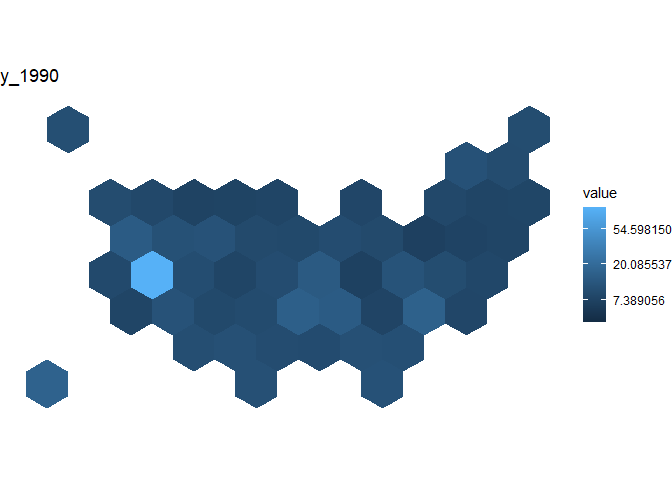

```{r setup, include=FALSE}
knitr::opts_chunk$set(echo = TRUE)

#devtools::install_github("UrbanInstitute/urbnmapr")
library(tidyverse)
library(urbnmapr) #for county shape files
library(gganimate)
```


```{r}
total_cases <- read.csv("covid_confirmed_usafacts.csv")

#total number of columsn 
last_col <- ncol(total_cases)

#information columns in data set
info_cols <- c(1:4)

#date starts in column 5
s_date <- 5

#rename date columns into date format 
names(total_cases)[s_date:last_col] <- format(as.Date(names(total_cases)[s_date:last_col], format = "X%m.%d.%y"), format = "%Y-%m-%d")

#rename columns 
names(total_cases)[info_cols] <- c("countyFIPS", "county_name", "state", "stateFIPS")
```

```{r}
no_county <- total_cases[,c(info_cols,last_col)] %>%
  filter(countyFIPS == 0)
c <- ncol(no_county)

total_cases_no_county <- sum(no_county[,c])


total_cases_usa <- sum(total_cases[,last_col])

scales::percent(total_cases_no_county / total_cases_usa, accuracy = 0.001)
```

```{r}
#calculate new cases per row 
f_NewCases <- function(vec){
  last_col <- length(vec)
  today <- vec[,(s_date + 1):last_col]
  yesterday <- vec[, s_date:(last_col-1)]
  new_per_day <- today - yesterday
  new_cases <- cbind(vec[,info_cols], new_per_day)
  new_cases
}

#calculate growth_factor per row 
f_GrowthFactor <- function(vec){
  last_col <- length(vec)
  today <- vec[,(s_date + 1):last_col]
  yesterday <- vec[, s_date:(last_col-1)]
  gf_per_day <- today/yesterday
  growth_factor <- cbind(vec[,info_cols], gf_per_day)
  growth_factor
}

#calculate moving average of growth factor per row
f_MAGrowthFactor <- function(vec){
  last_col <- length(vec)
  total_today <- vec[s_date:last_col]
  total_yesterday <- cbind(0, vec[s_date:(last_col-1)])
  new_per_day <- total_today - total_yesterday
  d <- length(new_per_day) #number of days
  new_today <- new_per_day[2:d]
  new_yesterday <- new_per_day[1:(d-1)]
  gf_per_day <- new_today / new_yesterday
  gf_per_day
  dates <- colnames(gf_per_day)
  t_gf <- t(gf_per_day)
  t_gf <- replace(t_gf, t_gf==Inf, inf_gf)
  ma_gf <- zoo::rollapply(t_gf, width=ma_k, mean, na.rm = TRUE)
  MAgrowth_factor <- t(ma_gf)
  colnames(MAgrowth_factor) <- dates[-c(1:4)]
  MAgrowth_factor <- cbind(vec[,info_cols], MAgrowth_factor)
  MAgrowth_factor
}

#apply the functions to the full data frame 
f_DataFrame <- function(df, vec_func){
  last_row <- nrow(df)
  datalist = list()
  for (i in 1:last_row){
    datalist[[i]] <- vec_func(df[i,])
 #   print(i)
  }
  new_df <- bind_rows(datalist)
  new_df
}
```

```{r, eval=FALSE}
ma_k <- 5
inf_gf <- 10


df_ma_gf<- f_DataFrame(total_cases, f_MAGrowthFactor)

write.csv(df_ma_gf, "df_ma_gf.csv")
```


```{r}
ma_k <- 5
inf_gf <- 10

by_state <- total_cases %>% 
  group_by(stateFIPS) %>%
  select(-countyFIPS, -county_name, -state) %>%
  summarize_all(funs(sum))

by_state_gf <- f_DataFrame(by_state, f_MAGrowthFactor)

state <- by_state_gf %>%
  pivot_longer(cols = -c(1), names_to = "date", values_to = "ma_gf") %>%
  filter(date >= as.Date("2020-04-25"))


```


```{r, eval=FALSE}
counties_sf <- get_urbn_map("counties", sf = TRUE) %>%
    mutate(
      state_fips = as.integer(state_fips)
      , county_fips = as.integer(county_fips)
    ) 
  
states_sf <- get_urbn_map("states", sf = TRUE) %>%
  mutate( state_fips = as.integer(state_fips))

together <- left_join(states_sf, state, by =c("state_fips" =  "stateFIPS"))

head(together)


```

```{r, eval=FALSE}
library(transformr)
together %>% 
  ggplot(aes(geometry = geometry)) +
  geom_sf(
      aes(fill = ma_gf)
    , color = "#ffffff") +
  theme_void() +
  transform_state(date)
```

```{r}
# library
library(tidyverse)
library(geojsonio)
library(RColorBrewer)
library(rgdal)

# Download the Hexagones boundaries at geojson format here: https://team.carto.com/u/andrew/tables/andrew.us_states_hexgrid/public/map.

# Load this file. (Note: I stored in a folder called DATA)
spdf <- geojson_read("us_states_hexgrid.geojson",  what = "sp")

# Bit of reformating
spdf@data = spdf@data %>%
  mutate(google_name = gsub(" \\(United States\\)", "", google_name))

# Show it
plot(spdf)
```

```{r}
library(broom)
spdf@data = spdf@data %>% mutate(google_name = gsub(" \\(United States\\)", "", google_name))
spdf_fortified <- tidy(spdf, region = "google_name")

# Calculate the centroid of each hexagon to add the label:
library(rgeos)
centers <- cbind.data.frame(data.frame(gCentroid(spdf, byid=TRUE), id=spdf@data$iso3166_2))
 
# Now I can plot this shape easily as described before:
#ggplot() +
#  geom_polygon(data = spdf_fortified, aes( x = long, y = lat, group = group), fill="skyblue", color="white") +
#  geom_text(data=centers, aes(x=x, y=y, label=id)) +
#  theme_void() +
#  coord_map()
```

```{r}
# Load mariage data
data <- read.table("https://raw.githubusercontent.com/holtzy/R-graph-gallery/master/DATA/State_mariage_rate.csv", header=T, sep=",", na.strings="---")
 
# Distribution of the marriage rate?
data %>% 
  ggplot( aes(x=y_2015)) + 
    geom_histogram(bins=20, fill='#69b3a2', color='white') + 
    scale_x_continuous(breaks = seq(1,30))

n_data <- data %>%
  pivot_longer(-c(1))

head(n_data)
```

```{r}
# Merge geospatial and numerical information
spdf_fortified <- spdf_fortified %>%
  left_join(. , n_data, by=c("id"="state")) 
 
# Make a first chloropleth map
goo <- ggplot() +
  geom_polygon(data = spdf_fortified, aes(fill =  value, x = long, y = lat, group = group)) +
  scale_fill_gradient(trans = "log") +
  theme_void() +
  coord_map() +
  transition_states(name, transition_length = 1, state_length = 1)+
  ggtitle('{closest_state}')

anim_save("goo.gif", goo)
```




