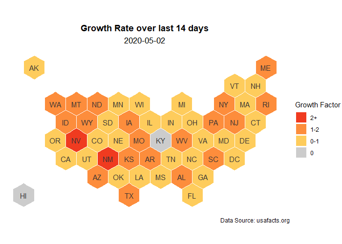
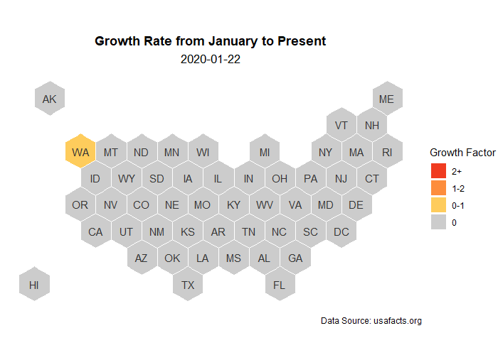
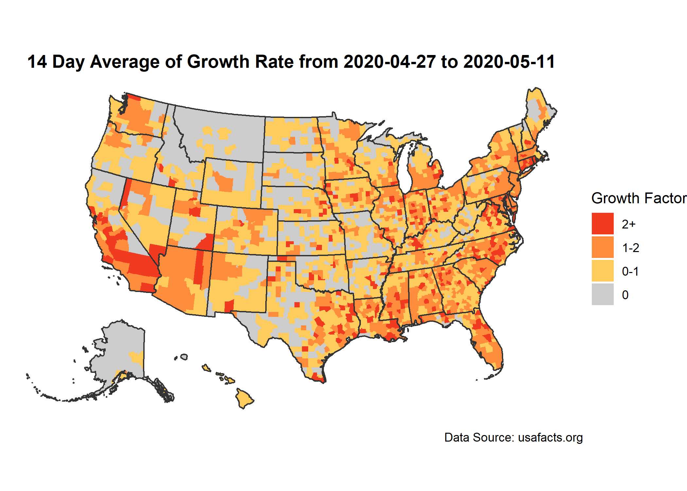

### Growth Factor - looking at states 

```{r, out.width = "80%", fig.align = 'center'}
knitr::include_graphics("img/hex_map.png")
```


```{r, out.width = "80%", fig.align = 'center'}

```

```{r, out.width = "80%", fig.align = 'center'}

```


### Growth Factor - looking at counties 

```{r, out.width = "80%", fig.align = 'center'}

```


