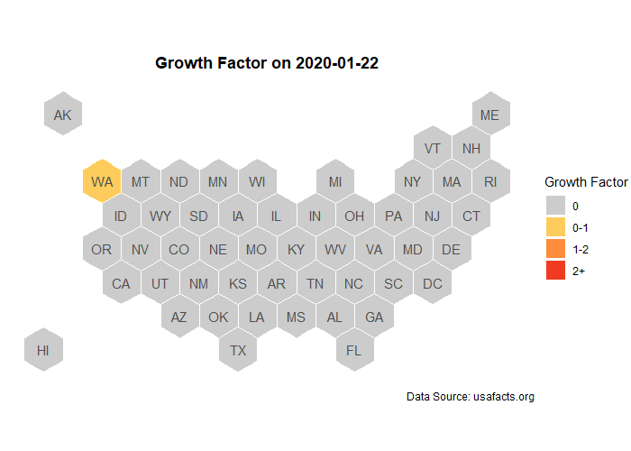

```{r, include = FALSE}
knitr::opts_chunk$set(message = FALSE, warning = FALSE, echo=FALSE, dpi = 300)
```

### Growth Factor - looking at states 

```{r, out.width = "100%", eval = TRUE}
knitr::include_graphics("img/hex_map.png")
```


```{r, out.width = "100%", eval = TRUE}

```


```{r, code = readLines("script/county-map.R"), eval = FALSE}
```


