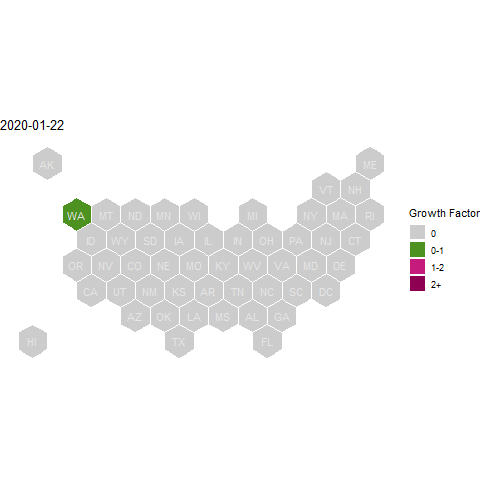

```{r}
knitr::opts_chunk$set(message = FALSE, warning = FALSE, echo=FALSE, dpi = 300)
```

### Average Growth Factor - looking at states 

```{r, code = readLines("script/hex-map.R")}
```

### Average Growth Factor - looking at counties

```{r, code = readLines("script/county-map.R")}
```




