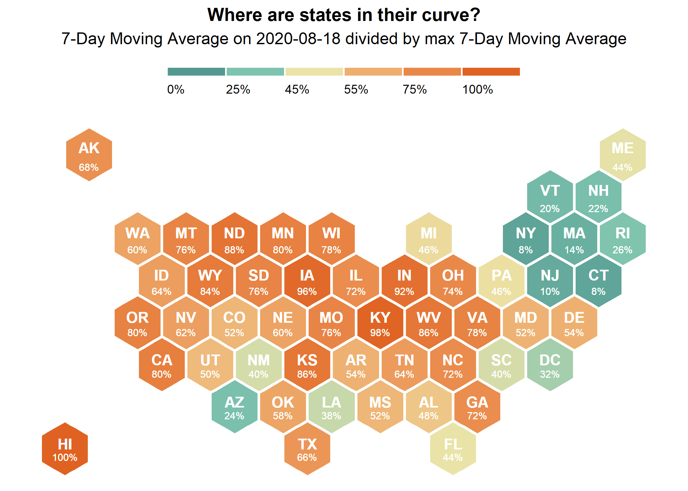
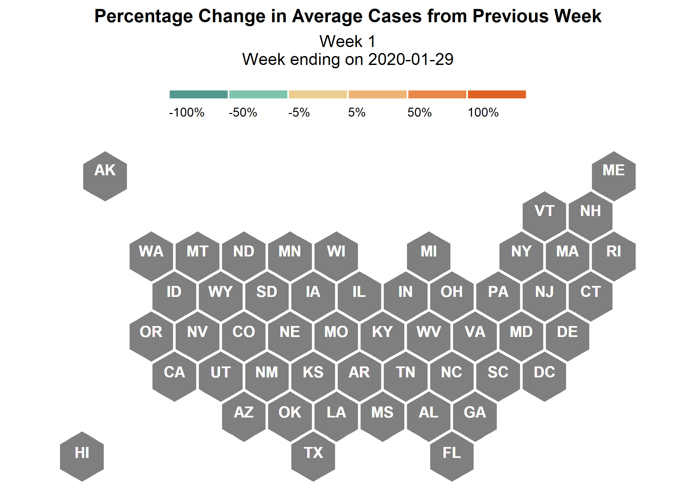

```{r, include = FALSE}
knitr::opts_chunk$set(echo = FALSE)
```
### Case Curves by State 

```{r state-facet-nc-script, message = FALSE, results = "hide", warning = FALSE}
source("script/plot/state_facet_nc.R") #creates facet_map of states' raw gf for past 14 days 
```


```{r state-facet-nc-img, out.width = "100%", fig.align = 'center'}
knitr::include_graphics("img/state_facet_0315.png")
```
<br>

```{r state-facet-trend14-img, out.width = "100%", fig.align = 'center'}
knitr::include_graphics("img/state_facet_trend14.png")
```
<br>

### Where are states in their curve?  

These plots are based on NPR's plots, the colors looked so nice I wanted to use them myself.  NPR plots can be found [here](https://www.npr.org/sections/health-shots/2020/03/16/816707182/map-tracking-the-spread-of-the-coronavirus-in-the-u-s).

I have normalized the 7-day moving average of new cases by dividing all of the moving average values by the max moving average value.  This puts all of the states of the same scale of 0 to 1; this is not to compare state to state in terms of total cases.  This plot is showing where states are their in their curve; higher percentages indicate that states are in an upper part of the curve.  If the value is 100%, that means that the current day has the highest 7-day moving average.  

```{r state-hex-script, message = FALSE, results = "hide", warning = FALSE}
source("script/plot/state_hex_norm.R")  
```

```{r state-hex_img, out.width = "100%", fig.align = 'center'}

```

<br>

```{r state-hex-gif-script, message = FALSE, results = "hide", warning = FALSE}
#source("script/plot/state_hex_gif.R") 
```

```{r state-hex-gif-script-img, out.width = "100%", fig.align = 'center'}
#
```

<br>

### Take a Closer Look! 

Build your own plot for a given state and time period by using a shiny app.  The app can be access through this  link, <a href="https://mareichler.shinyapps.io/diy-covid19-plots/" target = "_blank">mareichler.shinyapps.io/diy-covid19-plots/</a>, and is also embedded below:  

```{r, out.width = "100%"}
knitr::include_app("https://mareichler.shinyapps.io/diy-covid19-plots/", height = "500px")
```


