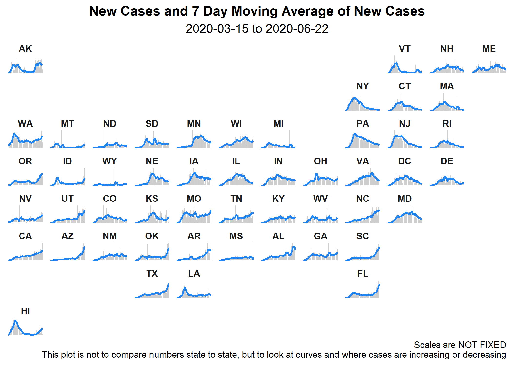
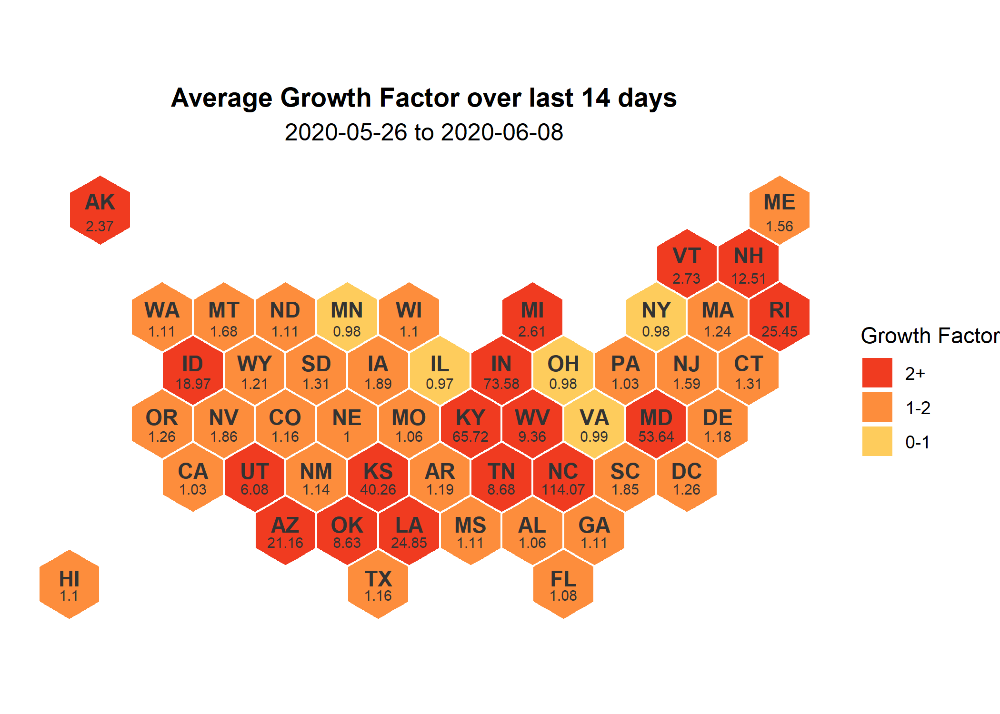
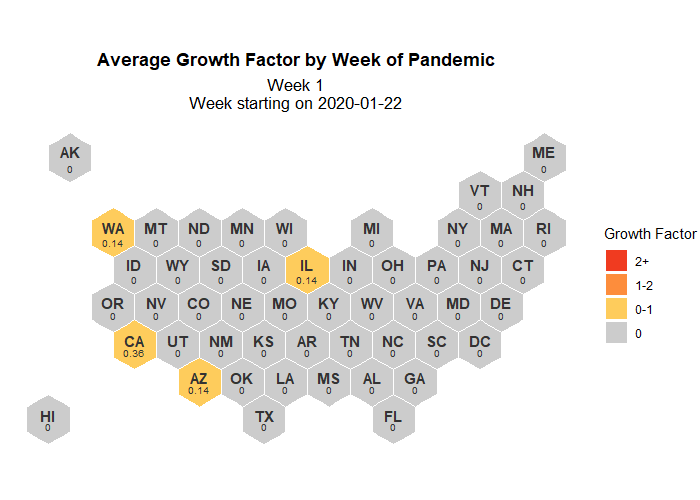

```{r, include = FALSE}
knitr::opts_chunk$set(echo = FALSE)
```
### New Cases by State  

```{r state-facet-nc-script, message = FALSE, results = "hide", warning = FALSE}
source("script/plot/state_facet_nc.R") #creates facet_map of states' raw gf for past 14 days 
```


```{r state-facet-nc-img, out.width = "100%", fig.align = 'center'}

```
<br>


### Recent Growth Factor by State

Since most of the COVID-19 measures are enacted by individual states, it may be more helpful for an individual to see the growth factor for the last 14 days in a specific state.  

```{r state-facet-script, message = FALSE, results = "hide", warning = FALSE}
source("script/plot/state_facet.R") #creates facet_map of states' raw gf for past 14 days 
```


```{r state-facet-img, out.width = "100%", fig.align = 'center'}
knitr::include_graphics("img/state_facet.png")
```
<br>

### Take a Closer Look! 

Build your own growth factor plot for a given state and time period by using a shiny app.  The app can be access through this  link, <a href="https://mareichler.shinyapps.io/diy-covid19-plots/" target = "_blank">mareichler.shinyapps.io/diy-covid19-plots/</a>, and is also embedded below:  

```{r, out.width = "100%"}
knitr::include_app("https://mareichler.shinyapps.io/diy-covid19-plots/", height = "500px")
```

<br> 


### Average Growth Rate per State

```{r state-14days-avg-script, message = FALSE, results = "hide", warning = FALSE}
source("script/plot/state_14days_avg.R") #creates hex map of state avg gf for past n days
```


This plot is a quick overview of the last two weeks for each state.  Using the three colors you can see which states have seen an average decrease in daily cases for 14 days (i.e. growth factor consistently below 1) and may be ready to start the re-opening process, which states are not ready to reopen and finally, which states may need additional social-distancing and lock-down measures.  

As mentioned in the Growth Factor tab, some states will have very large average growth factors.  This is most likely due to having 0 cases on one day and then a large number of cases the next day; often caused by test availability or reporting.  

```{r state-14days-avg-img, out.width = "100%", fig.align = 'center'}

```


```{r state-weekly-script, message = FALSE, results = "hide", warning = FALSE}
source("script/plot/state_weekly_gif.R") #creates hex map of state avg gf for past n days

first_date <- min(covid19_state_weekly$date)
```


This plot shows how the weekly average growth factor has changed by state since the start of the pandemic.  Week 1 starts on January 22, 2020, which is the first day data is available.  Although 7 days is an arbitrary cut-off point, separating the data into sections and averaging the growth factor helps see the spread of the virus. 

```{r state-weekly-img, out.width = "100%", fig.align = 'center'}

```

**Why are some of the growth factors negative?**
Having a negative growth factor is theoretically impossible; however some states end up having negative growth factors because they update their total case numbers to a lower number.  This results in having negative daily cases and then a negative growth factor.  