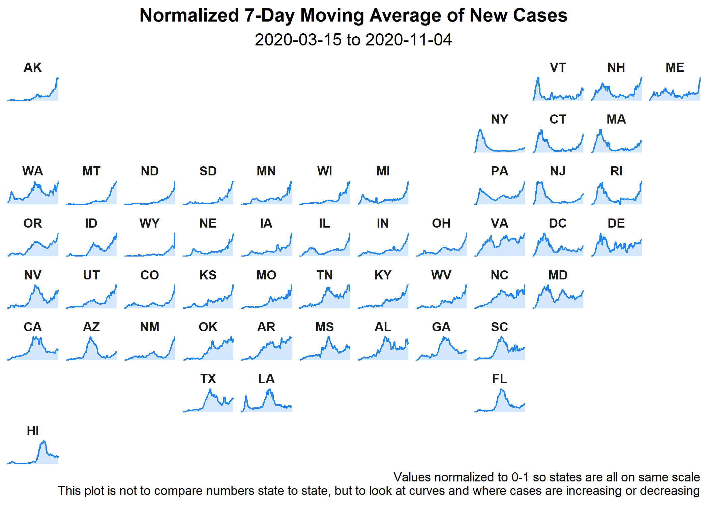
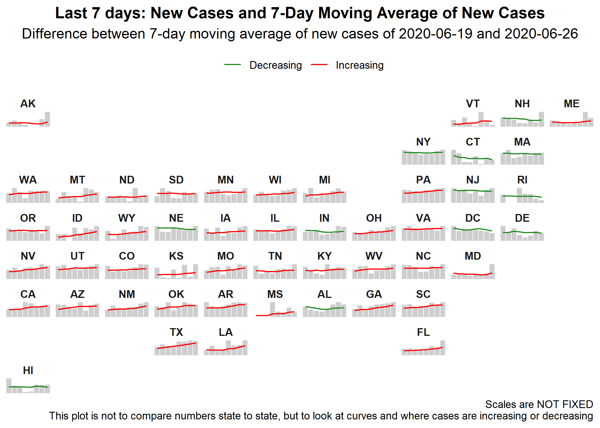
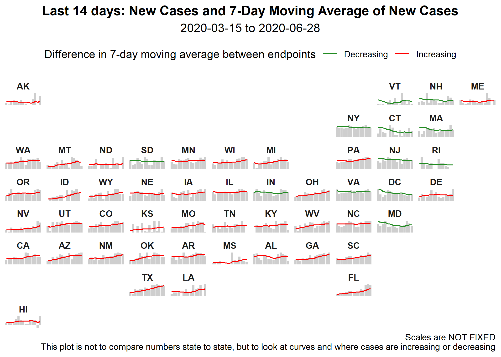
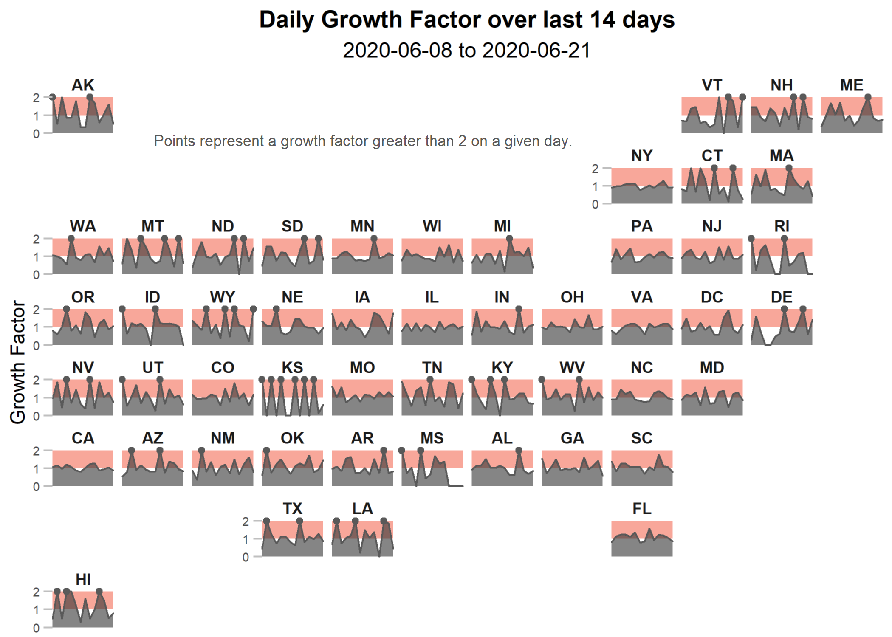

```{r, include = FALSE}
knitr::opts_chunk$set(echo = FALSE)
```
### Case Curves by State 

```{r state-facet-nc-script, message = FALSE, results = "hide", warning = FALSE}
source("script/plot/state_facet_nc.R") #creates facet_map of states' raw gf for past 14 days 
```


```{r state-facet-nc-img, out.width = "100%", fig.align = 'center'}

```
<br>

### Recent Trends 
Looking at trends from the past week and the past two weeks.  
```{r state-facet-trend7-img, out.width = "100%", fig.align = 'center'}

```
<br>

```{r state-facet-trend14-img, out.width = "100%", fig.align = 'center'}

```
<br>

### Recent Growth Factor by State

Since most of the COVID-19 measures are enacted by individual states, it may be more helpful for an individual to see the growth factor for the last 14 days in a specific state.  

```{r state-facet-script, message = FALSE, results = "hide", warning = FALSE}
source("script/plot/state_facet.R") #creates facet_map of states' raw gf for past 14 days 
```


```{r state-facet-img, out.width = "100%", fig.align = 'center'}

```
<br>


```{r, eval = FALSE, echo = FALSE}
### Take a Closer Look! 

Build your own growth factor plot for a given state and time period by using a shiny app.  The app can be access through this  link, <a href="https://mareichler.shinyapps.io/diy-covid19-plots/" target = "_blank">mareichler.shinyapps.io/diy-covid19-plots/</a>, and is also embedded below:  

#```{r, out.width = "100%"}
knitr::include_app("https://mareichler.shinyapps.io/diy-covid19-plots/", height = "500px")
#```
```


